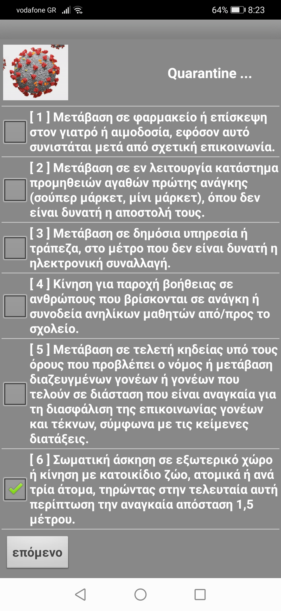
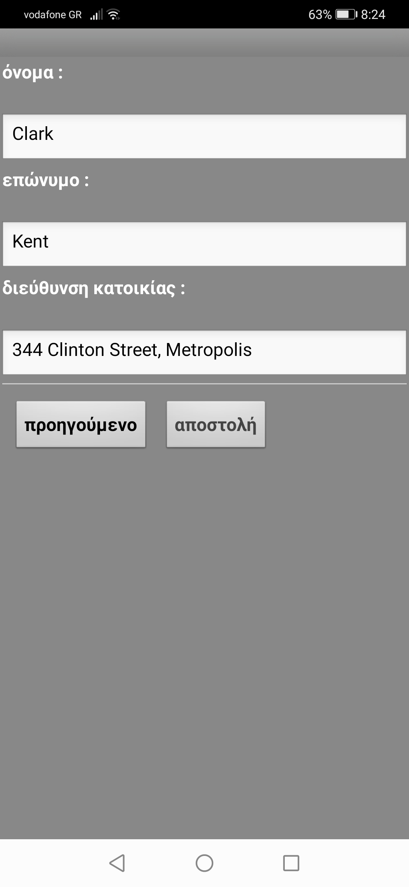
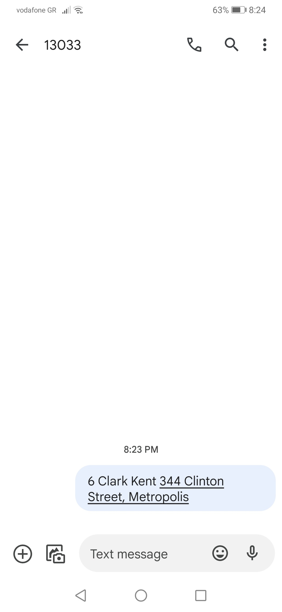

## COVID-19 Lockdown Movement Permit

All individuals residing in Greece was required to send an "SMS" text message to short-code "13033" in order to obtain permission to leave their homes during the lockdown.

This is an "Android" application that builds and sends such an "SMS" from the mobile phone to short-code "13033". "MIT App Inventor" platform used for the development of this application. "App Inventor" is a free, cloud-based service that allows you to make your own mobile apps using a blocks-based programming language. You access "App Inventor" using a web browser (Chrome, Firefox, Safari). 

The "Android application PacKage", i.e the application file ready for installation in an "Android" device is : ***"quarantine.apk"***

***"quarantine"*** folder contains the decompressed "apk" files and directories.

### Usage
The "SMS" to short-code "13033" is formatted as follows :

```
X [blank] full name and home address
```

where "X" was the reason for movement : 1, 2, 3, 4, 5, or 6 corresponding to the following reasons :

* [ 1 ] Movement to the pharmacy or visiting a doctor or to donate blood, in the case that this is recommended after a previous communication.
* [ 2 ] Movement to an in-service supply store of basic goods (supermarket, mini-market), where they cannot be sent out.
* [ 3 ] Movement to a public service or bank, insofar as electronic transaction is not possible.
* [ 4 ] Movement to help people in need or escort minors to/from school.
* [ 5 ] Movement to a funeral ceremony under the conditions laid down by law or movement of divorced or separated parents necessary to ensure communication between parents and children, in accordance with the provisions in force.
* [ 6 ] Physical exercise outdoors or movement with a pet, individually or per three persons, in the latter case having regard to the necessary distance of 1.5m.

The following response was received :

```
Movement [blank] X [blank] full name and address of residence
```







